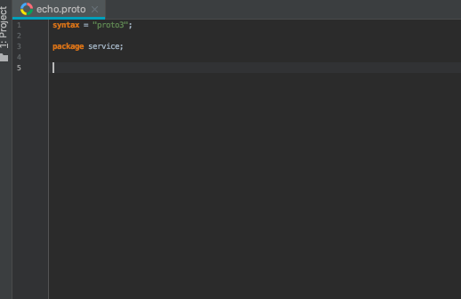

# Protobuf Lint Support for JetBrains IDEs
[](https://travis-ci.org/yoheimuta/intellij-protolint)

[Protocol Buffer Linter Plugin](https://plugins.jetbrains.com/plugin/12641-protocol-buffer-linter) for IntelliJ IDEA & other JetBrains products.

The latest plugin release is compatible with IntelliJ IDEA 2018.3.
Other JetBrains IDEs of the same or higher version should be supported as well.

Compatibility Matrix:

| Plugin Version  | IDE Version Range  |
|-----------------|--------------------|
| 0.1.0           | IDEA 2018.3        |

### Example

Using the following `.protolint.yaml` configuration file.

```yaml
lint:
  rules:
    no_default: true

    add:
      - MESSAGE_NAMES_UPPER_CAMEL_CASE
      - SERVICE_NAMES_UPPER_CAMEL_CASE
```



### Installation

You can install the plugin by opening "Plugins" settings, "Marketplace" - search for "Protocol Buffer Linter".

#### Dependencies

- [protolint](https://github.com/yoheimuta/protolint) must be installed.
- [protobuf-jetbrains-plugin](https://github.com/protostuff/protobuf-jetbrains-plugin) must be installed.
   - Note: This plugin is removed at the moment [#3](https://github.com/yoheimuta/intellij-protolint/issues/3), and you have to install the plugin from disk. Here are the steps.
      - Download the zip from [its release page](https://github.com/protostuff/protobuf-jetbrains-plugin/releases/tag/v0.13.0)
      - Follow the instruction: https://www.jetbrains.com/help/idea/managing-plugins.html#install_plugin_from_disk

### Configuration

The plugin does not require configuration by default, for the majority of projects it should work out of the box.

#### Path

The plugin refers to the `protolint` executable in your PATH by default.
You can configure the path to the `protolint` executable and its config directory through `Preferences -> Tools -> Protocol Buffer Linter`.

### Development

#### Build

```
./gradlew build
```

#### Run IntelliJ IDEA with enabled plugin

```
./gradlew runide
```
